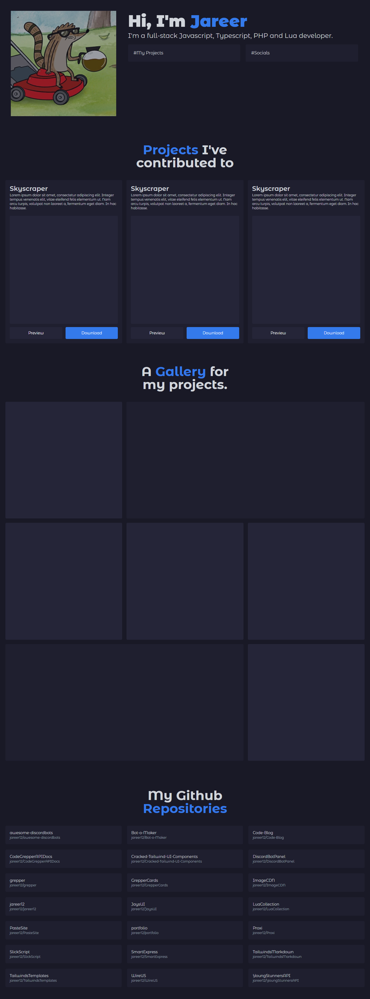

# Portfolio

🚀 A Prebuilt portfolio website for developers and online creators made with Javascript and Vue.js can be modified with JSON.

## Preview



## Installation

- First we'll clone this repository to our local machine, if you don't have the git CLI just download the repository.
- Once we have the cloned repository we'll install the required node modules.
- Wait for a while, after all the required modules are installed, we'll edit the JSON inside `/src/builder.js` to our liking.
- Now once we're done, we'll build for production and have our files in the `/dist` directory.

```shell
## Download
git clone https://github.com/jareer12/portfolio.git Portfolio
## Open Directory
cd Portfolio
## Install Modules
npm install
## Edit /src/builder.js
nano ./src/builder.js
## Build for Production
npm run build
```

## Themes

The portfolio comes with 5 prebuilt themes.

- `brew` - DodgerBlue
- `royal` - Orange
- `emerald` - Green
- `amethyst` - Pink
- `valencia` - Red
